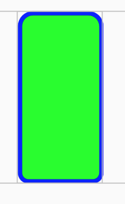
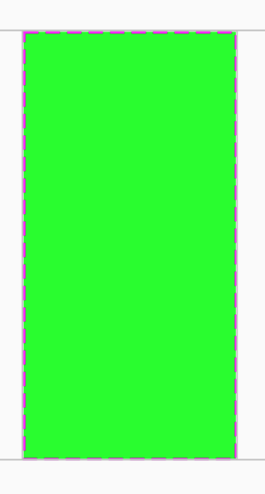
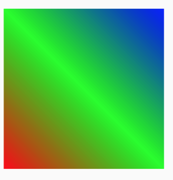
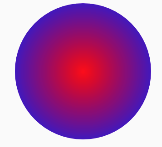
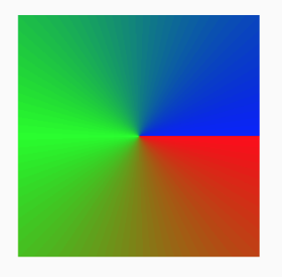
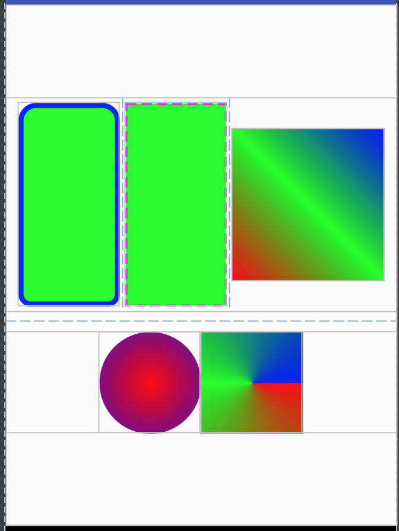

# ShapeView
#### 1. 项目说明

​        系统自带的 shape 虽然很方便的实现各种效果,但由于是 用`XML drawable `定义的,导致**灵活度差**,改个颜色必须得重新复制一份新的 `XML` 文件, 最后导致`xml drawable`中文件爆炸(我司`XML shape` 文件已超过500个),

类似于这样:

```
bg_wolf_game_check.xml
bg_wolf_game_guard.xml
bg_wolf_game_poison.xml
bg_wolf_game_raid.xml
bg_wolf_game_rescue.xml
bg_wolf_game_revenge.xml
black_5_oval_rectangle_stroke_shape.xml
black_5_oval_shape.xml
black_5_oval_stroke_shape.xml
black_15_oval_shape.xml
black_15_oval_stroke_shape.xml
```

项目初衷就是用自定义属性实现 shape 效果,改个颜色,

再也不用写 XML 写到**蛋疼**;


#### 2. 导入

添加依赖库

```
project build.gradle加入jitpack

allprojects {
	repositories {
		...
		maven { url "https://jitpack.io" }
	}
}

项目的build.gradle加入
compile 'com.github.Mr-wangyong:ShapeView:v1.0'
```


#### 3. 开始使用

本项目采用自定义 View 实现 XML shape效果,**属性字段和系统 XML 一样**,更加灵活使用,

1. 圆角,描边, shape, 填充(这也是开发中最常用的):

   ````
   <com.mrwang.ShapeView
         android:id="@+id/shape"
         android:layout_width="50dp"
         android:layout_height="100dp"
         app:cornersBottomLeftRadius="10dp"
         app:cornersBottomRightRadius="10dp"
         app:cornersTopLeftRadius="15dp"
         app:cornersTopRightRadius="15dp"
         app:shape="rectangle"
         app:solidColor="#00ff00"
         app:strokeColor="#ff0000"
         app:strokeWidth="2dp"/>
   ````

   

2. 带虚线的边框

   ```
       <com.mrwang.ShapeView
         android:id="@+id/shape_2"
         android:layout_width="150dp"
         android:layout_height="300dp"
         app:shape="rectangle"
         app:solidColor="#00ff00"
         app:strokeColor="#ff00ff"
         app:strokeDashGap="5dp"
         app:strokeDashWidth="10dp"
         app:strokeWidth="2dp"/>
   ```

   

3. 线性渐变:

   ```
   <com.mrwang.ShapeView
         android:id="@+id/shape_4"
         android:layout_width="100dp"
         android:layout_height="100dp"
         android:layout_marginRight="10dp"
         android:layout_marginLeft="10dp"
         app:gradientAngle="45"
         app:gradientCenterColor="#00ff00"
         app:gradientEndColor="#0000ff"
         app:gradientStartColor="#ff0000"
         app:gradientType="linear"
         app:shape="rectangle"/>
   ```

   

4. 放射渐变:

   ```
   <com.mrwang.ShapeView
         android:id="@+id/shape_3"
         android:layout_width="100dp"
         android:layout_height="100dp"
         app:gradientEndColor="#0000ff"
         app:gradientRadius="100dp"
         app:gradientStartColor="#ff0000"
         app:gradientType="sweep"
         app:gradientUseLevel="false"
         app:shape="oval"/>
   ```

   

   ​

5. 扫描渐变:

   ```
   <com.mrwang.ShapeView
         android:id="@+id/shape_5"
         android:layout_width="100dp"
         android:layout_height="100dp"
         app:gradientAngle="45"
         app:gradientCenterColor="#00ff00"
         app:gradientEndColor="#0000ff"
         app:gradientStartColor="#ff0000"
         app:gradientType="radial"
         app:shape="rectangle"/>
   ```

   

最后来一张全家福:


